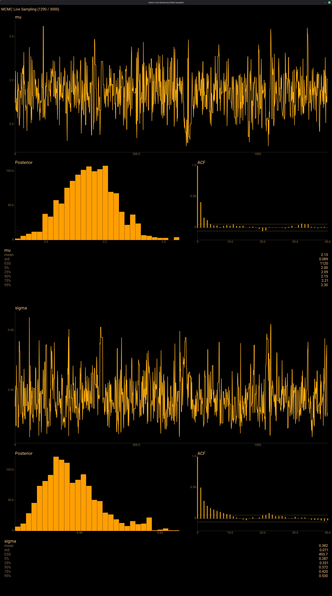
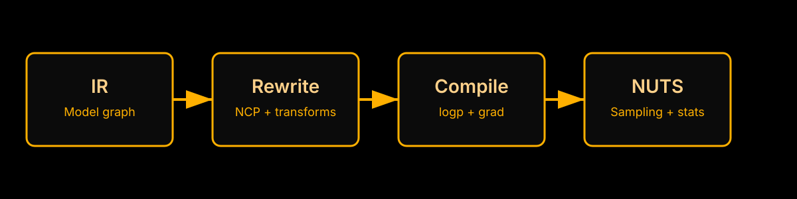
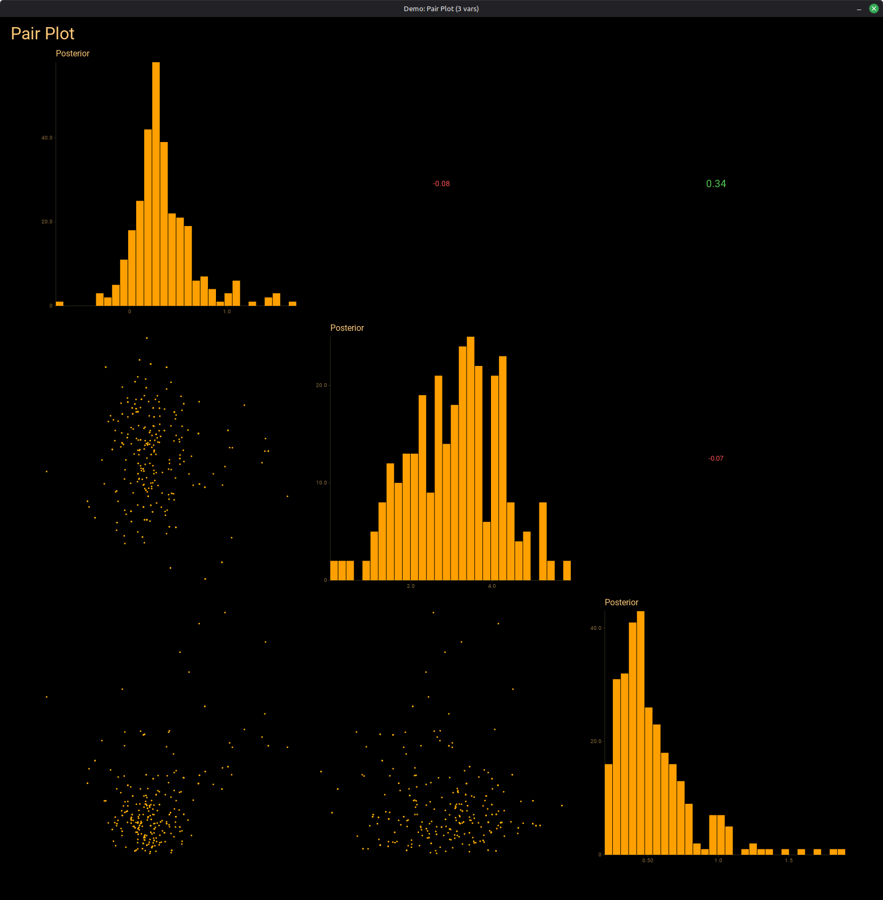

# eXMC


> *"One does not translate a minor work. One translates the work that would not leave one alone."* — [Translator's Foreword](FOREWORD.md)

**A PPL environment on the BEAM, inspired by PyMC.** eXMC is a from-scratch Elixir implementation of PyMC's architecture: declarative model specification, automatic constraint transforms, NUTS sampling, and Bayesian diagnostics — all on Nx tensors with optional EXLA acceleration.

**With deep respect:** this project builds on the ideas, rigor, and ergonomics pioneered by the PyMC community. The goal is not to replace PyMC. The goal is to preserve correctness and usability while exploring what changes when the runtime is the BEAM.



## Why A New PPL Environment?

PyMC established a high bar for statistical correctness, extensibility, and user experience. eXMC asks a focused question:

**What happens if that architecture runs on a fault-tolerant, massively concurrent runtime?**

The BEAM gives us lightweight processes, isolation, and message passing. That changes how we think about multi-chain sampling, streaming diagnostics, and observability. eXMC keeps PyMC's model semantics and diagnostics philosophy, while rethinking execution.

## What We Preserve From PyMC

- Model semantics and ergonomics: declarative RVs, clear constraints, sensible defaults.
- Statistical correctness: NUTS with Stan-style three-phase warmup, ESS/R-hat, WAIC/LOO.
- Composable diagnostics: traces, energy, autocorrelation, and predictive checks.

## What The BEAM Enables

- **Concurrency without copies.** Four chains are four lightweight processes sharing one compiled model. No `cloudpickle`, no `multiprocessing.Pool`, no four copies of the interpreter. `Task.async_stream` dispatches them across all cores.
- **Per-sample streaming.** `sample_stream/4` sends each posterior sample as a message to any BEAM process — a Scenic window, a Phoenix LiveView, a GenServer computing running statistics. [Nutpie](https://github.com/pymc-devs/nutpie) sets the standard for live MCMC UX with rich terminal progress bars (per-chain draws, divergences, step size, gradients/draw), `blocking=False` with pause/resume/abort, and access to incomplete traces. eXMC takes a different approach: instead of a built-in terminal display, it streams individual samples as BEAM messages, composing with whatever visualization layer you choose — Scenic for native desktop, Phoenix LiveView for browser, or a custom GenServer for online statistics.
- **Fault isolation.** A chain that hits a numerical singularity — NaN gradient, EXLA crash, memory fault — is caught and replaced with a divergent placeholder. The other chains keep running. The supervisor tree doesn't care.
- **Distribution as a language primitive.** `Distributed.sample_chains/2` sends model IR to remote `:peer` nodes via `:erpc`. Each node compiles independently (heterogeneous hardware). If a node dies, the chain retries on the coordinator automatically. Zero external infrastructure.

## Performance

**Not published at the moment, deliberately.** The PyMC comparison that used to
sit here (seven models, February 2026) was measured before two NUTS correctness
fixes that change which states a trajectory draws, so its ESS-per-second figures
describe a sampler that no longer exists. It is kept, with that banner, in
[`STANDARD_BENCHMARKS.md`](STANDARD_BENCHMARKS.md).

It is being re-run against the latest PyMC release, with a committed harness,
the same ESS estimator for both frameworks, a correctness check on every run,
and the commit, host and arm recorded ([`docs/PYMC_RACE_PLAN.md`](docs/PYMC_RACE_PLAN.md)).
Numbers return here when that run exists.

What is measured today, with its provenance, is the GPU arm's reach
([`docs/ARMS.md`](docs/ARMS.md)): on hosts without EXLA, NUTS on the fused chain
shader against the host tree. That is not a speed claim against EXLA, which wins
wherever it exists.

## Quick Start

```elixir
alias Exmc.{Builder, Dist.Normal, Dist.HalfNormal}

# Define a hierarchical model
ir =
  Builder.new_ir()
  |> Builder.rv("mu", Normal, %{mu: Nx.tensor(0.0), sigma: Nx.tensor(5.0)})
  |> Builder.rv("sigma", HalfNormal, %{sigma: Nx.tensor(2.0)})
  |> Builder.rv("x", Normal, %{mu: "mu", sigma: "sigma"})
  |> Builder.obs("x_obs", "x",
    Nx.tensor([2.1, 1.8, 2.5, 2.0, 1.9, 2.3, 2.2, 1.7, 2.4, 2.6])
  )

# Sample
{trace, stats} = Exmc.NUTS.Sampler.sample(ir,
  %{"mu" => 2.0, "sigma" => 1.0},
  num_samples: 1000, num_warmup: 500
)

# Posterior mean
Nx.mean(trace["mu"]) |> Nx.to_number()
# => ~2.1
```

### DSL Syntax

```elixir
use Exmc.DSL

ir = model do
  rv("mu", Normal, %{mu: Nx.tensor(0.0), sigma: Nx.tensor(5.0)})
  rv("sigma", HalfNormal, %{sigma: Nx.tensor(2.0)})
  rv("x", Normal, %{mu: "mu", sigma: "sigma"})
  obs("x_obs", "x", Nx.tensor([2.1, 1.8, 2.5]))
end
```

### Multi-Chain

```elixir
# Parallel chains — compile once, run on all cores
{traces, stats_list} = Exmc.NUTS.Sampler.sample_chains(ir, 4,
  init_values: %{"mu" => 2.0, "sigma" => 1.0}
)
```

### Streaming

```elixir
# Stream samples to any process — LiveView, GenServer, Scenic window
Exmc.NUTS.Sampler.sample_stream(ir, self(), %{"mu" => 2.0, "sigma" => 1.0},
  num_warmup: 500, num_samples: 1000
)

# Receive samples as they arrive
receive do
  {:exmc_sample, point, stat} -> IO.inspect(point["mu"])
end
```

### Distributed

```elixir
# Spawn peer nodes and sample across them — zero infrastructure
{:ok, _pid, node1} = :peer.start_link(%{name: :worker1})
{:ok, _pid, node2} = :peer.start_link(%{name: :worker2})

{traces, stats_list} = Exmc.NUTS.Distributed.sample_chains(ir,
  nodes: [node(), node1, node2],
  init_values: %{"mu" => 2.0, "sigma" => 1.0}
)
# Node dies? Chain retries on coordinator automatically.
```

## Inference Methods

| Method | Module | Use Case |
|--------|--------|----------|
| **NUTS** | `Exmc.NUTS.Sampler` | Gold standard. Stan-style three-phase warmup, multinomial trajectory sampling, rho-based U-turn criterion |
| **ADVI** | `Exmc.ADVI` | Fast approximate posterior. Mean-field normal in unconstrained space, stochastic gradient ELBO |
| **SMC** | `Exmc.SMC` | Multimodal posteriors. Likelihood tempering with Metropolis-Hastings transitions |
| **Pathfinder** | `Exmc.Pathfinder` | L-BFGS path toward mode with diagonal normal fit at each step. Fast initialization for NUTS |

## Distributions

| Distribution | Support | Transform | Params |
|-------------|---------|-----------|--------|
| `Normal` | R | none | `mu`, `sigma` |
| `HalfNormal` | R+ | `:log` | `sigma` |
| `Exponential` | R+ | `:log` | `rate` |
| `Gamma` | R+ | `:softplus` | `alpha`, `beta` |
| `Beta` | (0,1) | `:logit` | `alpha`, `beta` |
| `Uniform` | (a,b) | `:logit` | `low`, `high` |
| `StudentT` | R | none | `nu`, `mu`, `sigma` |
| `Cauchy` | R | none | `mu`, `sigma` |
| `LogNormal` | R+ | `:log` | `mu`, `sigma` |
| `Laplace` | R | none | `mu`, `b` |
| `MvNormal` | R^d | none | `mu` (vector), `cov` (matrix) |
| `GaussianRandomWalk` | R^T | none | `sigma` |
| `Dirichlet` | Δ^K (simplex) | `:stick_breaking` | `alpha` (vector) |
| `Custom` | any | user-defined | user-defined closure |
| `Mixture` | any | component-based | `weights`, `components` |
| `Censored` | any | wraps base dist | `dist`, `lower`, `upper` |

## Key Features

- **Automatic Non-Centered Parameterization.** Hierarchical Normals where both `mu` and `sigma` are parent references are rewritten to `z ~ N(0,1)` with `x = mu + sigma * z`. Disable with `ncp: false` when data is informative.
- **EXLA auto-detection.** When EXLA is available, `value_and_grad` is JIT-compiled. Falls back to BinaryBackend transparently. GPU via `device: :cuda`.
- **Vectorized observations.** Pass `Nx.tensor([...])` to `Builder.obs` — reduction is handled automatically. No need to create one RV per data point.
- **Model comparison.** WAIC and LOO-CV via `Exmc.ModelComparison.compare/1`.
- **Prior and posterior predictive.** `Exmc.Predictive.prior_samples/2` and `posterior_predictive/2` for model checking.
- **Custom distributions.** `Exmc.Dist.Custom` takes a `logpdf` closure — any differentiable density. Used for Bernoulli likelihoods, random walk models, and domain-specific densities.
- **Fault-tolerant tree building.** Four layers: IEEE 754 NaN/Inf detection, subtree early termination, trajectory-level divergence tracking, process-level crash recovery via `try/rescue`.
- **Deterministic seeding.** Erlang `:rand` with explicit state threading. On one host, one build and one arm, a chain is reproducible bit-for-bit given `{seed, tuning_params, ir}`. Across hosts it is reproducible statistically, not bitwise — see [Reproducibility](#reproducibility).

## Architecture

```
Builder.new_ir()                        # 1. Declare
|> Builder.rv("mu", Normal, params)     #    your model
|> Builder.rv("sigma", HalfNormal, ...) #    as an IR graph
|> Builder.obs("y", "x", data)          #
                                        #
Rewrite.run(ir, passes)                 # 2. Rewrite passes:
  # affine -> meas_obs                  #    NCP, measurable ops,
  # non-centered parameterization       #    constraint transforms
                                        #
Compiler.compile_for_sampling(ir)       # 3. Compile to:
  # => {vag_fn, step_fn, pm, ncp_info}  #    logp + gradient closure
                                        #    (EXLA JIT when available)
                                        #
Sampler.sample(ir, init, opts)          # 4. NUTS with Stan-style
  # => {trace, stats}                   #    three-phase warmup
```

Four layers, each a clean boundary:

| Layer | Modules | Responsibility |
|-------|---------|----------------|
| **IR** | `Builder`, `DSL`, `IR`, `Node`, `Dist.*` | Model as data. 16 distributions (3 vector-valued), 3 node types |
| **Compiler** | `Compiler`, `PointMap`, `Transform`, `Rewrite` | IR to differentiable closure. Transforms, Jacobians, NCP |
| **NUTS** | `Leapfrog`, `Tree`, `MassMatrix`, `StepSize` | Multinomial NUTS (Betancourt 2017) with diagonal/dense mass |
| **Sampler** | `Sampler`, `Distributed`, `Diagnostics`, `Predictive` | Orchestration, warmup, ESS, R-hat, streaming, distribution |



## Diagnostics

```elixir
# Summary statistics
Exmc.Diagnostics.summary(trace)
# => %{"mu" => %{mean: 2.15, std: 0.31, q5: 1.63, q50: 2.14, q95: 2.68}, ...}

# Effective sample size and R-hat
Exmc.Diagnostics.ess(trace["mu"])
Exmc.Diagnostics.rhat([trace1["mu"], trace2["mu"]])

# Model comparison
Exmc.ModelComparison.compare([
  {"model_a", Exmc.ModelComparison.waic(ll_a)},
  {"model_b", Exmc.ModelComparison.waic(ll_b)}
])
```

## Companion: ExmcViz

See [`../exmc_viz/`](../exmc_viz/) for native ArviZ-style diagnostics built on [Scenic](https://github.com/ScenicFramework/scenic) — trace plots, histograms, ACF, pair plots, forest plots, energy diagnostics, and live streaming visualization during sampling.

```elixir
ExmcViz.show(trace, stats)                    # static dashboard
ExmcViz.stream(ir, init, num_samples: 5000)   # live sampling dashboard
```



## Backends: three arms

eXMC's tensor operations go through [Nx](https://github.com/elixir-nx/nx).
Every model runs on three arms, and `Exmc.JIT` picks one at boot in the order
EXLA > Vulkan > Evaluator unless `config :exmc, :compiler` names it:

| arm | `:compiler` | what it is | where it is the deploy option |
|---|---|---|---|
| **CPU** | `:none` | `Nx.Defn.Evaluator` on `Nx.BinaryBackend`. Slow, no native code, always correct | everywhere; the reference the other two are checked against |
| **EXLA** | `:exla` | XLA JIT, CUDA or the CPU build ([`docs/EXLA_CPU_BUILD.md`](docs/EXLA_CPU_BUILD.md)) | Linux |
| **Vulkan** | `:vulkan` | [`nx_vulkan`](https://github.com/borodark/nx_vulkan): f64 compute, and a fused f64 NUTS chain shader synthesised from the model | **FreeBSD, where it is the only GPU option**; on Linux it is raced against EXLA on the same box |

All three are f64. `Exmc.JIT.describe/0` prints which arm a process has,
and `test/test_helper.exs` prints it at the top of every suite run — read
that line before reading a failure.

The GPU arm is about **reach, not speed**. Where EXLA exists, use it: on the
same machine, EXLA on the CPU beats the Vulkan per-op path at every model size
measured. The Vulkan arm exists for hardware EXLA cannot reach, and there it is
the difference between a GPU and the interpreter: NUTS on the fused chain
shader ran 9–10x faster end to end than the host tree on a FreeBSD GT 750M and
on an Intel HD 520 ([`docs/ARMS.md`](docs/ARMS.md)).

### Where it runs

Support is stated per platform and arm, and it is what the fleet measures, not
what ought to work. Every row names the hardware it was measured on; the
expected suite result per host, and the commit it was measured at, are in
[`docs/ARMS.md`](docs/ARMS.md).

| tier | platform | arm | measured on |
|---|---|---|---|
| **1** | Linux x86_64 | EXLA | RTX 3060 Ti host (CUDA build, host client in tests) |
| **1** | FreeBSD 15 amd64, NVIDIA | Vulkan | GeForce GT 650M, GT 750M (Kepler, driver 470) |
| **2** | FreeBSD 15 amd64, Intel iGPU | Vulkan (Mesa ANV) | HD Graphics 520 (Skylake) |
| **2** | Linux aarch64, NVIDIA Tegra | Vulkan | Jetson Nano, Tegra X1 (L4T 32.7) |
| **2** | Linux x86_64, NVIDIA | Vulkan | RTX 3060 Ti — run for comparison against EXLA on the same box |
| — | anywhere OTP 27 and Elixir 1.18 run | CPU | the reference arm; no native code |

- **Tier 1** is a release gate: the full suite and the consumer-path smoke test
  (`scripts/vulkan_smoke.exs`, sampling under `mix run`) run at the release
  commit, and a result that differs from `docs/ARMS.md` blocks the release.
- **Tier 2** runs in the same fleet with the same gates, and its known issues
  are documented rather than release-blocking: slow-host timeouts on the
  Jetson; on Mesa ANV, `log`/`exp` and f64 division that differ from NVIDIA in
  the last bits (exmc's chain shaders never emit GLSL `pow`, so ANV's
  negative-base `pow` cannot reach them).
- **Commodity integrated GPUs are a target class.** Intel and AMD iGPUs on
  Mesa are the largest installed base of GPUs without CUDA, which is exactly
  the hardware the Vulkan arm exists for. Intel (ANV) is Tier 2 today; AMD
  (RADV) joins the table when a fleet host runs it.
- **Not supported, because never run:** macOS and Apple GPUs (EMLX is
  postponed for want of hardware, and nothing has run through MoltenVK), AMD
  GPUs (Mesa RADV) until the above, Windows, and Vulkan devices without f64.
  Some of these may work; none is claimed until a host in the fleet runs it.

### Reproducibility

- **Same host, same build, same arm, same seed:** identical draws, bit for bit.
- **Across hosts, or across arms:** the same posterior, statistically — not the
  same draws. Chains start identical and diverge once a last-bit difference
  flips an accept/reject decision, which a long chain eventually does. The
  differences are measured, not hypothetical: the host `libm` returns different
  bits for `log`, `exp` and `pow` on glibc 2.39 x86_64, glibc 2.27 aarch64 and
  FreeBSD's msun (only `sqrt`, which IEEE 754 requires to be correctly rounded,
  agrees), and GPU vendors differ in `log`/`exp` and division. This holds on
  the CPU arm too; it is not a GPU artifact.

So compare runs from different machines the way you would compare two
independent samplers: posterior means within their Monte-Carlo standard errors
(ESS-sized), not equal to the digit. That is also how exmc is validated: the
suite's statistical checks are sized by ESS, and `bench/nuts_truth.exs` and
`bench/nuts_width_race.exs` score posteriors against closed-form truth on every
host. Every sampler result carries `stats.provenance` (arm, device, versions,
host, seed), and `test/reproducibility_contract_test.exs` enforces the same-host
promise on every arm. For an exact replay, match that record and `mix.lock`.
The measurements are in [`docs/REPRODUCIBILITY.md`](docs/REPRODUCIBILITY.md).

### Dependencies and how they are wired

`nx_vulkan` and `exla` are both `optional: true`, so a consumer gets neither
unless it declares them in its own `mix.exs`. `exla` is also `runtime: false`:
an EXLA that is present but cannot load its NIF (the CUDA build without
`libnvshmem_host.so.3` on the path is the usual case) is treated as absent and
the run falls through to the next arm, rather than aborting the VM.

`nx_vulkan` comes from a private git server on this LAN, following `main`,
with the concrete sha in `mix.lock`. To iterate against a local checkout or to
bisect a backend regression:

```bash
NX_VULKAN_PATH=/path/to/nx_vulkan mix deps.get   # sibling checkout
NX_VULKAN_REF=<sha> mix deps.get                 # one rev, without editing mix.exs
NX_PATH=/path/to/nx-monorepo mix deps.get        # unreleased nx + exla
```

The pin policy, and why the lock rather than `mix.exs` holds the sha, is the
long comment above `nx_vulkan_dep/1` in `mix.exs`. `nx` is pinned to three
components (`~> 0.13.1`) here and in nx_vulkan, and the two must agree.

Two application keys matter to a consumer. `config :exmc, :compiler` selects
the arm (`:exla | :vulkan | :none | :auto`); `config :exmc, :force_precision`
forces `:f32` or `:f64` and is otherwise `:f64` on every arm. The
`EXMC_COMPILER` environment variable sets the first of those, but only through
this repo's own `config/runtime.exs` — a dependency's config is never loaded,
so from a consumer it does nothing.

### Testing

```bash
mix test                          # the suite on whatever arm this host detects
EXMC_COMPILER=vulkan mix test     # the same suite, arm named explicitly
scripts/fleet_verify.sh           # the fleet gate: every GPU box, counts compared
```

`test/test_helper.exs` excludes `:diag` and `:slow` by default, and
`:requires_vulkan` on hosts without a Vulkan device; a Vulkan host runs those
and excludes `:vulkan_known_failure` instead. The two Vulkan invocations
above are the same arm and report the same failures (since 2026-09-12; before
that the explicit form allowed per-op fallback for one refused model and the
auto-detected form did not). `fleet_verify.sh` also pins each host's GPU by
uuid and runs the consumer-path smoke test before the suite. The expected
per-host results and their known failures are in [`docs/ARMS.md`](docs/ARMS.md).

## The Ecosystem: _Three Comrades_

_Probabiliers de tous les a priori, unissez-vous!_

eXMC is one of three standalone libraries for Bayesian inference on the BEAM.
Each covers a different inference family. Each is independent — no shared
dependencies beyond Elixir itself.

| Library | Algorithm | For | Deps |
|---|---|---|---|
| **eXMC** | NUTS / HMC, ADVI, SMC, Pathfinder | Known parametric models, continuous parameters | Nx; EXLA or nx_vulkan optional |
| [**smc_ex**](https://github.com/borodark/smc_ex) | Bootstrap PF, PMCMC, Online SMC² | Discrete state transitions, streaming data, epidemic tracking | **zero** |
| [**StochTree-Ex**](https://github.com/borodark/ex_stochtree) | BART (Bayesian Additive Regression Trees) | Unknown functional form, feature discovery, nonparametric regression | Rustler |

**When to use which:**

- Your model has a known structure with continuous parameters → **eXMC** (NUTS)
- Your states are discrete (SEIR, HMM, regime-switching) and data streams in → **smc_ex** (O-SMC²)
- You don't know the functional form and want to discover which features matter → **StochTree-Ex** (BART)
- You want all three in one application → they compose. Each is a Mix dependency with no conflicts.

## Architectural Decisions

Every non-trivial choice is recorded in [`DECISIONS.md`](DECISIONS.md) with rationale, assumptions, and implications. From "why `:rand` instead of `Nx.Random`" to "why auto-NCP" to "why compile once for parallel chains."

## License

eXMC is dual-licensed:

- **Community License:** [Apache 2.0](LICENSE_COMMUNITY.md) — free and open source
- **Commercial License:** [Proprietary](LICENSE_COMMERCIAL.md) — for enterprises, OEM embedding, and closed-source use

Choose one. If you use the Community License, you must comply with Apache 2.0. If you need proprietary use, hosted/SaaS deployment, or enterprise support, contact sales@octanix.com for a Commercial License.
